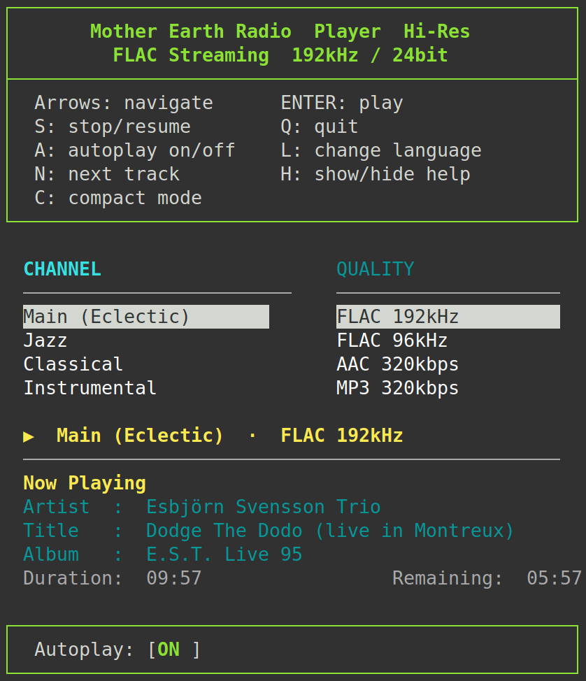
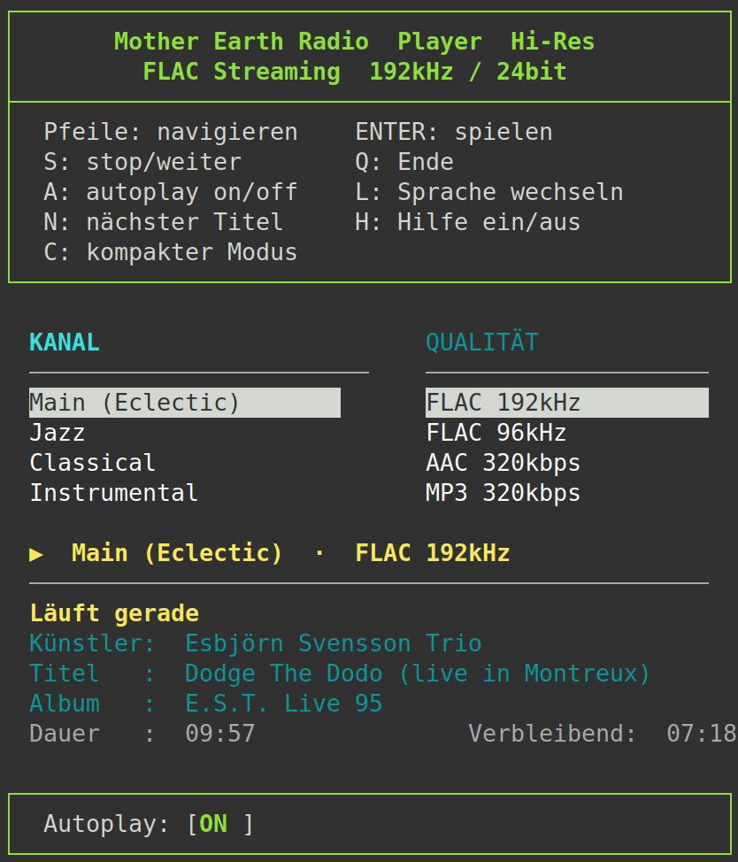
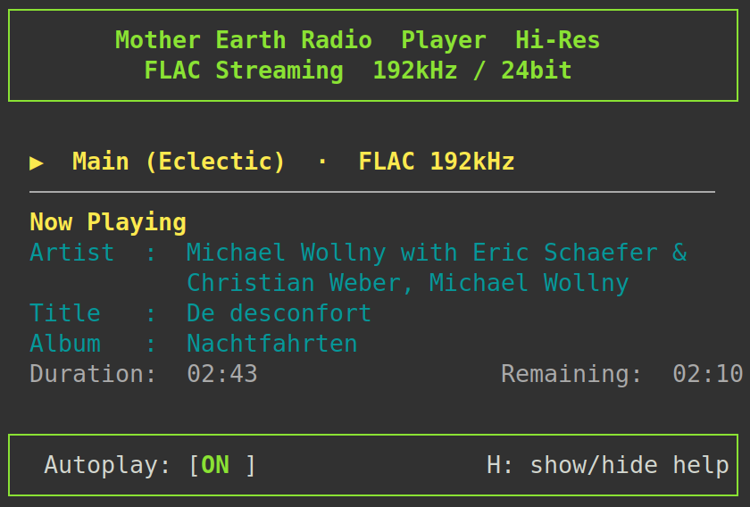
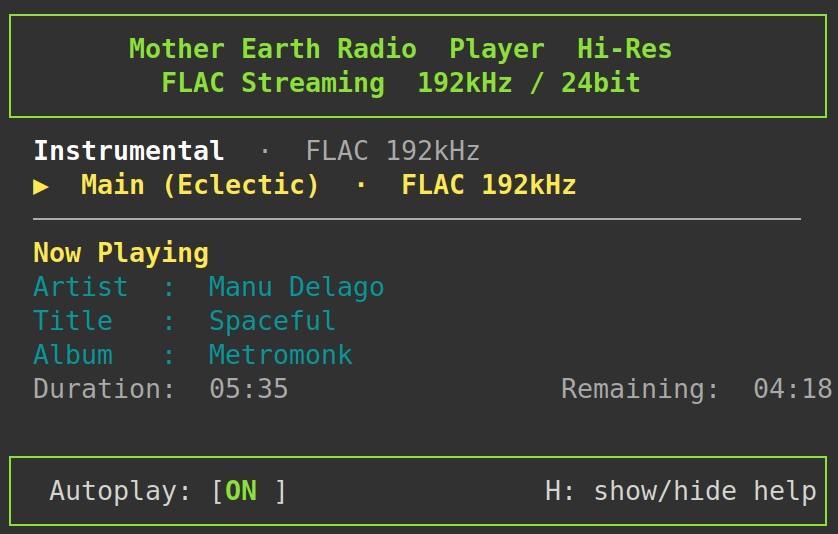
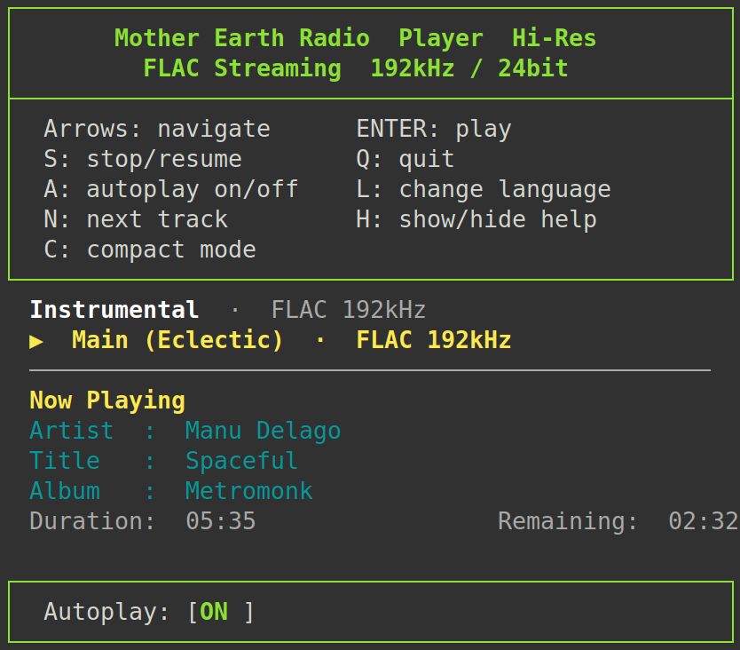

# Mother Earth Radio Player

A terminal-based Hi-Res audio player for [Mother Earth Radio](https://www.motherearthradio.de) — a German independent internet radio station broadcasting high-quality lossless music across multiple curated channels, completely free and without commercials.

This player provides a lightweight, keyboard-driven TUI (Text User Interface) for Linux, built with Python and `curses`. It is designed for users who want to enjoy Mother Earth Radio directly from the terminal without a graphical application, with full control over channel and stream quality selection.

**Disclaimer**: this player is an independent, unofficial client. It connects to the publicly available streams and API provided by [Mother Earth Radio](https://www.motherearthradio.de). Please support the station if you enjoy their work.

---

## Screenshots

### Full Interface 
Full interface with the two-column layout: channel list on the left, quality levels on the right. The active column is highlighted in bold cyan; the selected item is shown with a reverse-video highlight.
Languages available: English, German, Italian, Spanish, French




### Compact mode — idle
Compact mode hides both selection columns, leaving only the now-playing status and track metadata. Press **C** to toggle.




### Compact mode — navigating
When an arrow key is pressed in compact mode a single-line selection bar appears between the banner and the status line. The active field (channel or quality) is shown in **bold**; the inactive one is dimmed. The bar disappears after pressing **ENTER**, **S**, or **ESC**.



### Help panel visible
The help box inside the banner lists all keyboard shortcuts. Press **H** to show or hide it. The preference is saved across sessions.



---

## Features

### Channels
Four curated Mother Earth Radio channels are available:

| Channel | Description |
|---|---|
| Main (Eclectic) | The flagship channel — eclectic mix of genres |
| Jazz | Jazz and related styles |
| Classical | Classical music |
| Instrumental | Instrumental music across genres |

### Stream Quality
Each channel offers four quality levels:

| Quality | Format |
|---|---|
| FLAC 192kHz | Lossless, highest quality |
| FLAC 96kHz | Lossless, default |
| AAC 320kbps | Lossy, high quality |
| MP3 320kbps | Lossy, compatible |

### Now Playing Metadata
Track information is retrieved in real time from the AzuraCast public API:

- Artist, Title, Album
- Track duration and time remaining
- Smart polling: the player sleeps until the current track ends, minimising unnecessary API calls

### Up Next
Hold the **N** key to peek at the next scheduled track (artist, title, album).

### Autoplay
The player can start automatically on launch, resuming the last-used channel and quality.

### Stop / Resume
Press **S** to stop playback. The channel and quality remain displayed. Press **S** again to resume the same stream without having to reselect it.

### Compact Mode
Press **C** to hide the channel and quality selection columns. Ideal for users who always listen to the same channel and want a minimal interface showing only the now-playing information.

Navigation still works exactly as in normal mode. When an arrow key is pressed, a selection bar appears showing the currently highlighted channel and quality — the active field is shown in **bold**, the inactive one in dimmed text, matching the focus state. The bar disappears after:

- pressing **ENTER** (playback starts and the info is already shown in the status line)
- pressing **S** (stop)
- pressing **ESC**

### Multilingual Interface
The UI is available in five languages, switchable at runtime with the **L** key:

- English (default)
- German
- Italian
- French
- Spanish

Language preference is saved and restored on next launch.

### Persistent Configuration
User preferences are saved automatically to `~/.config/mer_player.json`:

- Last channel and quality selected
- Autoplay on/off
- Language
- Help panel visibility
- Compact mode on/off

---

## Keyboard Reference

| Key | Action |
|---|---|
| Arrow keys | Navigate channels and quality |
| `ENTER` | Start playback |
| `S` | Stop / resume |
| `A` | Toggle autoplay |
| `N` *(hold)* | Peek at next track |
| `L` | Cycle language (EN → DE → IT → FR → ES) |
| `H` | Show / hide help panel |
| `C` | Toggle compact mode |
| `ESC` | *(compact mode)* Dismiss selection bar |
| `Q` | Quit |

---

## Requirements

- Python 3.7+
- [`mpv`](https://mpv.io/) (recommended), `vlc`, or `ffplay`

Install `mpv` on Debian/Ubuntu:

```bash
sudo apt install mpv
```

---

## Installation

No installation required. Clone the repository and run the script:

```bash
git clone https://github.com/maranji/mother-earth-radio.git
cd mother-earth-radio
python3 mer_player.py
```

> Replace `YOUR_USERNAME` with your GitHub username.

---

## License

This project is open source, released under the [MIT License](LICENSE).

This software is provided **as is**, without any warranty of fitness for a particular purpose or guarantee of correct operation. The developer provides **no user support** of any kind.

---

